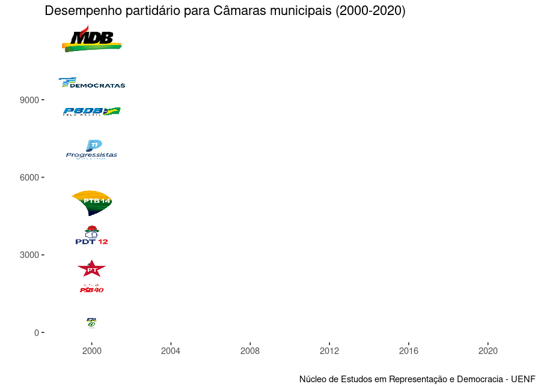

```{r setup, include=FALSE}
options(htmltools.dir.version = FALSE)
knitr::opts_chunk$set(
  echo = FALSE,
  fig.align = "center",
  message = FALSE,
  warning = FALSE,
  cache = TRUE
)

 
# 
# library(tidyverse)
# library(geobr)
# library(ggthemes)
# library(viridis)
# library(readr)
# 

```

--- 


# Pergunta de pesquisa:


### Temos um novo sistema de partidos a partir das eleições de 2020?

---

# Objetivos:

1 - Apontar as alterações  institucionais do sistema eleitoral

2 - Analisar a evolução dos desempenhos dos partidos políticos

3 - Descrever longitudinalmente a competição eleitoral municipal

4 - Radiografar a fragmentação das Câmaras Municipais


---
# Mudanças institucionais do sistema eleitoral


- Mudanças nas magnitudes dos distritos

- Coligações Eleitorais

- Financiamento de Campanhas

- HGPE

- Tempo das campanhas

- Clausulas de barreiras e desempenhos individuais

- Fidelidade partidária

- Cotas de gênero

- Regulamentação das campanhas nas redes sociais


---
# Partidos Políticos e desempenho municipal

```{r, echo=FALSE, out.width= "120%"}


```
---
# Partidos Políticos e desempenho municipal
```{r, echo=FALSE, out.width= "100%"}




```


---
# Competição eleitoral

```{r, echo=FALSE, out.width= "100%"}


knitr::include_graphics("nep_eleitoral.png")

```


---
# Competição eleitoral por tamanho
```{r, echo=FALSE, out.width= "100%"}


```


---
# Fragmentação das Câmaras Municipais 

```{r, echo=FALSE, out.width= "100%"}


```

---
# Considerações finais


- a importância das análises longitudinais para a compreensão dos percursos.

- necessidade de acompanhamento das próximas eleições para verificar a cristalização dos efeitos das reformas.

- a manter o fim das coligações ha uma tendência a uma restruturação do sistema partidário com possibilidade de um redesenho para um subsistema municipal.


